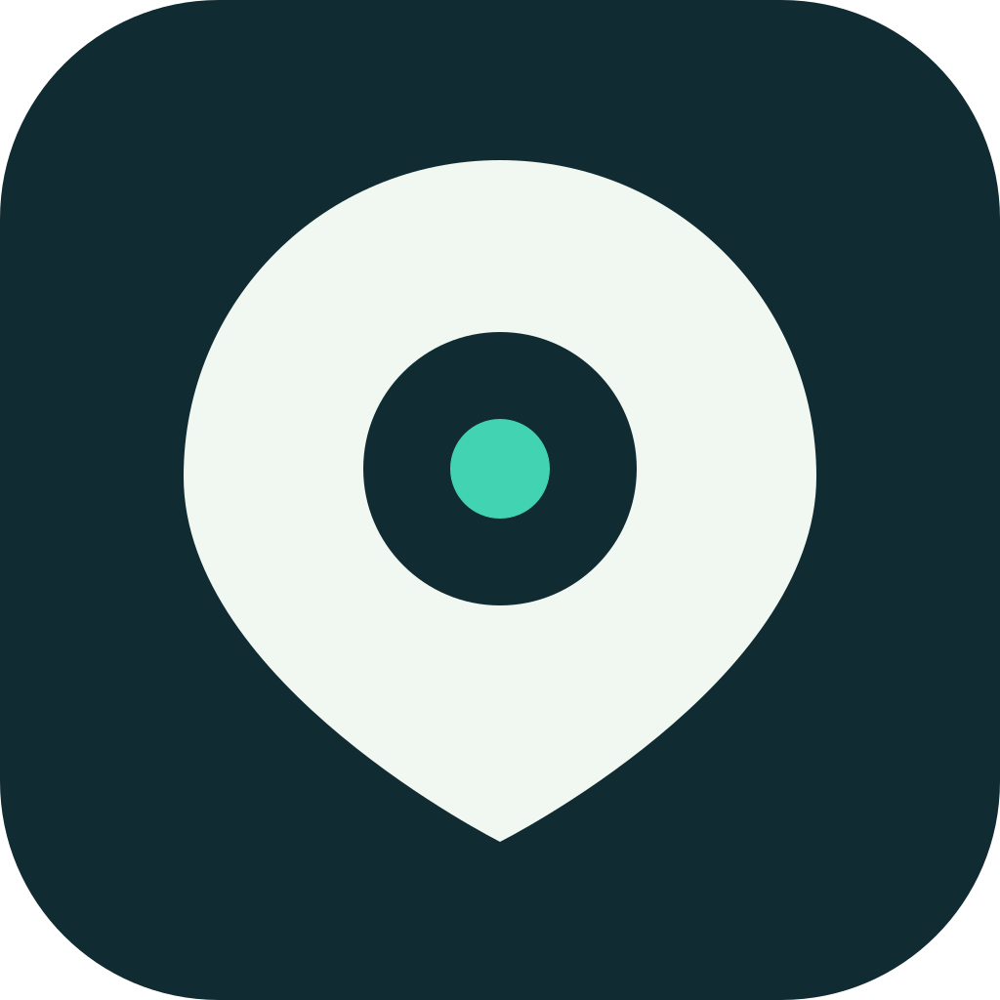
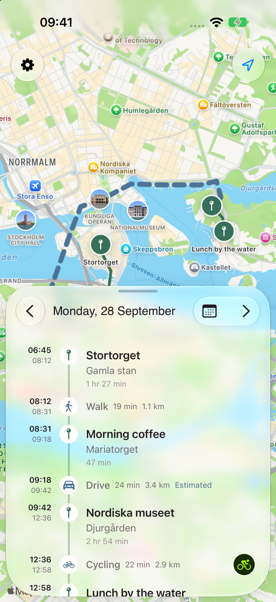
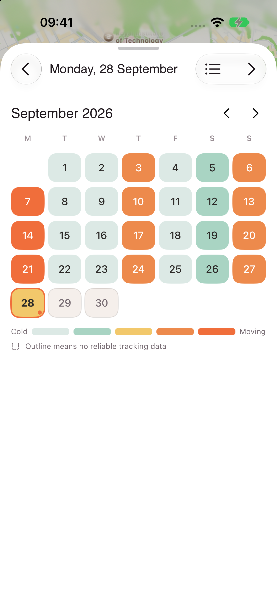

<div align="center">
  
  <h1>Locations</h1>
  <p><strong>Your places and journeys, recorded on your iPhone.</strong></p>
  <p>A personal location diary. Built for you to own, host, and make your own.</p>
  <p>
    <a href="#get-it-running">Get started</a> ·
    <a href="docs/setup.md">Host your backup</a> ·
    <a href="#make-it-your-own">Make it yours</a> ·
    <a href="docs/privacy.md">Privacy</a>
  </p>
  <p><strong>SwiftUI</strong> &nbsp; / &nbsp; <strong>iOS 26+</strong> &nbsp; / &nbsp; <strong>Optional self-hosted sync</strong> &nbsp; / &nbsp; <a href="LICENSE">MIT</a></p>
</div>

<br />

<div align="center">
  
  &nbsp;&nbsp;
  
  <p><sub>The real iPhone interface, with fictional Stockholm demo data. No personal location history.</sub></p>
</div>

<br />

Locations builds a personal timeline of where you went, when you arrived and
left, and how you travelled. It records visits and driving routes in the
background, lets you name places and correct journeys, and keeps the original
capture record on your phone.

It is a personal app you can build, host, and adapt with a coding agent. Use it
as a location diary, a starting point for a drive journal, or a foundation for
something specific to your daily life.

## What it does

- Records visits and journeys, with detailed route capture while driving.
- Shows your history on a map with times, routes, and distances.
- Remembers saved places and Home, and supports manual timeline corrections.
- Preserves recorded routes and handles delayed location reports and relaunches.
- Optionally syncs to your own PostgreSQL server for backup and phone recovery.
- Offers read-only MCP tools so an agent can explore your recorded history.

The app works locally without Railway. Connecting a server adds cloud backup,
restoration, and MCP access; capture continues offline and uploads retry later.
iOS controls background delivery, and force-quitting interrupts background
capture and transfers until the app is opened again.

This repository contains source code, not an App Store or TestFlight download.
The server currently stores **one person's timeline with one active recording
phone**. Give each person their own server and database; it is not a shared
multi-user service.

## Get it running

You need a Mac with full Xcode, XcodeGen, and an iPhone running iOS 26 or later.
The native package uses Swift 6.2 or later; this project has been tested with
Xcode 27. Node.js 22 or later and pnpm 10 are needed for the optional server.

```sh
git clone https://github.com/christianalares/locations.git
cd locations
pnpm install --frozen-lockfile
cd apps/ios
xcodegen generate
open LocationsIOS.xcodeproj
```

In Xcode, choose your own unique bundle identifier and development team, select
your iPhone, then build and run. On a fresh installation, open Settings, enable
**Track visits and journeys**, and grant Always and Precise Location access.
Motion access helps identify driving. Existing users replacing a phone should
connect and restore their backup before enabling tracking.

A **free Apple Account can build and install on your own phone** through an
Xcode Personal Team, but its provisioning profile expires after seven days.
You must rebuild and reinstall periodically. Every physical-device build needs
signing; Xcode can manage it. A paid Apple Developer Program membership is
better suited to ongoing use and is required to distribute through TestFlight
or the App Store. Friends installing through those channels do not need their
own developer membership. See [iPhone installation and signing](docs/signing.md).

For backup and agent access, see [personal server setup](docs/setup.md). Railway
is the supported deployment recipe here, but the API can run on another Node.js
host with PostgreSQL and HTTPS. Hosting and any paid Apple membership are your
own costs.

## Ask your agent to set it up

Fork or clone this repository and give your agent this prompt:

> Set up Locations for my own iPhone. Read AGENTS.md, docs/setup.md,
> docs/signing.md, and docs/privacy.md first. Start with local recording, or
> create a separate Railway project and PostgreSQL database in my account if
> I want backup and MCP. Keep credentials out of Git. Show me the infrastructure
> plan before applying it, configure my own signing identity and bundle ID,
> and verify a fresh drive and sync before calling setup complete. Do not use
> another person's backend or import sample history as my data.

The agent can handle dependency installation, infrastructure configuration,
builds, and checks. You still complete account sign-in, accept hosting costs,
and approve permissions and Developer Mode on your phone.

## Make it your own

A drive journal is a useful extension. For example:

> Add a vehicle profile and let me enter its starting odometer reading when
> I first use the app. Track estimated mileage from recorded drives, let me
> enter later odometer readings to reconcile it, classify trips as business
> or private, and export a CSV. Keep odometer readings separate from GPS
> distance and preserve the original route and capture evidence.

Those odometer, classification, and CSV features are **ideas for a fork, not
features already implemented here**. GPS distance can miss unrecorded driving;
a starting reading plus recorded distance is an estimate. Later real odometer
readings provide the reconciliation points. A driving-specific fork should
also allow selecting which journeys belong to a particular vehicle.

## Your data

The iPhone ledger is the primary capture record. PostgreSQL mirrors days and
backs up retained observations, visits, saved places, Home, and edit intent.
The cloud records are readable by the server and database administrators;
there is no end-to-end encryption.

The device token protects native reads, writes, and restoration and stays in
the iPhone Keychain. MCP tokens cannot write. A read token omits coordinates
but still reveals place names and visit times; a detail token can return drive
routes only when explicitly requested. See [privacy](docs/privacy.md) and
[sync and recovery](docs/sync-and-restore.md). Tests and built-in previews use
fictional Null Island fixtures. The README screenshots use a separate fictional Stockholm
demo at public landmarks; neither uses a live location ledger.

## Development

```sh
pnpm check
swift test --package-path swift
```

Use full Xcode for native tests. To include the PostgreSQL integration test,
set `LOCATIONS_TEST_DATABASE_URL` to an isolated test database. Without it,
that test is skipped.

| Directory | Contents |
| --- | --- |
| `apps/ios/` | SwiftUI iPhone app and XcodeGen project |
| `swift/` | Capture, timeline, persistence, sync, and native tests |
| `server/` | PostgreSQL API, read-only MCP, and server tests |
| `.railway/` | Infrastructure definition |
| `docs/` | Setup, signing, privacy, migration, and recovery |

The timeline engine was ported from Blip. Preserve its capture and recovery
behavior when making changes; repository rules are in [AGENTS.md](AGENTS.md).
Existing Blip users should follow [migration checks](docs/migration.md).

## License

[MIT](LICENSE). The bundled Bricolage Grotesque font retains its
[SIL Open Font License](apps/ios/LocationsIOS/Fonts/BricolageGrotesque-OFL.txt).
